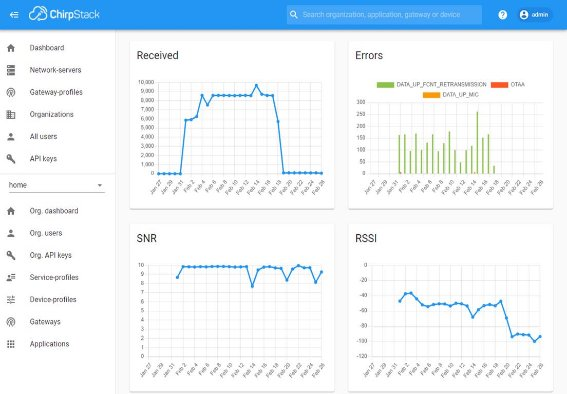

1. **작품 제목**

딥러닝 기반 미세먼지 예측 모델을 활용한 실내·외 저전력 원격감시체계

2. **작품 개요**

**2.1. 배경 및 목적**

전 세계 많은 국가들이 최근 몇 년 동안 악화된 대기 질 모니터링에 많은 관심을 기울이고 있다. 국내 사례로는 대기 배출사업장에서 오염물질을 24시간 감시하는 원격감시체계를 도입했다. 교육부 는 학교 고농도 미세먼지 대책으로서 신축학교의 기계환기설비 설치를 의무화하였고 기존 학교에 기 계 환기 설비 설치를 권고했다. 여건에 따라서는 공기청정기를 설치하도록 하고 있다.

PM2.5는 직경이 2.5μm 이하인 입자상 물질이다. 이런 PM2.5는 기존 방법인 실내 공기청정기 가 동으로는 농도를 줄일 수 없다. 그 이유는 공기청정기 작동으로 인해 환기량 감소하여 실내 이산화탄 소 농도가 약 2,300ppm까지 증가하기 때문이다. PM2.5가 고농도에 도달 시, 호흡기관, 심혈관 그리 고 뇌혈관계를 손상을 주며, 더 나아가, 폐암을 유발하는 대기오염물질 뿐만 아니라 사람의 시력에 악 영향을 주어 불편을 일으켜 운전 시 교통사고로 이어질 수 있다.

이러한 PM2.5 농도는 일반 성인보다 면역력이 약한 학생, 노인, 환자가 집중되어 있는 학교, 병원, 요 양원 등에서 자주 확인이 돼야한다. 이에 본 시스템은 단순한 PM2.5 값 모니터링은 환경의 현재 상태 만 보여주어 문제 해결에 한계가 있다고 생각하여 제공된 PM2.5의 양을 기반으로 실내 환경을 올바 르게 조성하고 야외활동 시 합리적인 준비에 도움을 줄 수 있다

본 시스템은 LoRaWAN과 딥러닝 모델인 CNN(Convolution neural network)과 LSTM(Long-short term memory)을 이용하여 PM2.5 값을 예측 및 실시간으로 환경 센서 값을 실시간으로 모니터링하 는 스마트 알림 시스템을 제안한다.

**[그림 1 제안하는 시스템의 SWOT]**

3. **작품 설명**
1. **주요 동작 및 특징**

**[그림 2 제안하는 시스템 개요도]**

[그림 2]는 딥러닝 기반의 미세먼지 예측 모델을 활용한 실내·외 저전력 원격감시체계 개요도를 보 여준다. 실내·외 미세먼지 및 온도, 습도, 이산화탄소 등을 측정하기 위한 복합 공기질 측정 단말은 게 이트웨이와 무선으로 연결된다. 단말 센서 값은 이미지, 비디오와 같이 큰 페이로드를 요구하지 않아 저전력 장거리 무선 통신인 LoRa를 채택했다. LoRa는 Semtech이 소유하고 있는 특허 기술로 CSS(Chirp Spread Spectrum) 변조 방식을 사용한다. 이 변조 방식은 데이터 신호를 Chirp 신호를 이 용하여 최소 필요 주파수 대역보다 더 넓은 주파수 대역으로 확산시켜 전송하는 기술로서, 혼선 및 간섭, 전파방해에 매우 강하다. 이러한 장점으로 네트워크가 구축되어 있지 않은 야외나 네트워크 구 축이 힘든 실내 환경에 활용 가능하며, 도심지는 최대 2~15km, 자연은 30km까지 통신이 가능하다. [그림 2]에서 게이트웨이와 서버는 링크 계층인 LoRaWAN(LoRa wide area network)에 해당하는데 수 십에서 수 천대에 이르는 LoRa 단말을 제어하는 역할 등을 한다, 특징은 아래와 같다.

- 변조 방식 : CSS, FSK(Frequency shift keying)
- 접속 절차 : OTAA(Over the air activation), ABP(Activation by personalization)
- Class : Class A, Class B, Class C
- 토폴로지 : 성형 토폴로지
- 네트워크 보안 : AES 128 암호화
- 세션 키 : 네트워크 세션 키, 어플리케이션 세션 키

장점은 아래와 같다.

- 낮은 사용료와 저렴한 초기 구축비
- 단순한 접속 절차 (OTAA, ABP)로 대량의 단말기(End Device) 간단하게 수용 가능
- 단말이 복수의 기지국에 접속하여 최적의 경로로 네트워크에서 단말기로 데이터 전송이 가능
- 기기 간 동기를 맞출 필요가 없고, 채널에 대한 모니터링이 필요 없음

하지만, 위 장점들로 불구하고 LoRa는 전송 속도가 느려 실시간으로 모니터링하여 상황 대처하 는 것이 굉장히 어렵다. 지능형 사물인터넷의 인공지능 서버는 LoRa 서버와 인터넷으로 연결되며, 복 합 공기질 측정 단말로부터 수신한 데이터 분석 및 인공지능 모델 예측을 통해 실시간으로 모니터링 서비스 서버로 전달하여 사용자에게 실시간으로 빠른 분석 및 대처를 가능케 한다.

2. **전체 시스템 구성**

**[그림 3 제안하는 시스템의 네트워크 구조]**

[그림 3]은 제안하는 시스템의 네트워크 구조를 보여주며, 복합 공기질 측정 단말, LoRa 게이트웨 이(게이트웨이), LoRa 서버 그리고 인공지능 서버 및 모니터링 서버로 구성된다.

**[그림 4 딥러닝 기반의 미세먼지 예측 모델을 활용한 실내외 저전력 원격감시체계 ]**

` `[그림 4]는 딥러닝 기반의 미세먼지 예측 모델을 활용한 실내외 저전력 원격감시체계의 예시를 보 여준다. 실내∙외에서의 단말들은 게이트웨이로 LoRa 통신으로 연결된다. 게이트웨이는 MQTT로 LoRa 서버와 연결된다. 인공지능 서버는 LoRa 서버로부터 HTTP Post 형식으로 데이터를 수신 받아 곧바로 데이터를 파싱을 거친 후, 미리 준비된 LSTM 모델을 통해 1시간 후의 PM2.5를 예측하여 사용자에게 SMS로 알리고, ThingsBoard Demo 서버로 전달하여 사용자에게 시각화 된 데이터를 제공한다.

3. **개발 환경(개발 언어, Tool, 사용)**

**표 1 개발 언어**

| 개발언어 | 라이브러리          | 버전   |
| -------- | ------------------- | ------ |
| C++      | Arduino.h           |        |
|          | MKRWAN.h            | 1.0.15 |
|          | AM1008k_k_i2c.h     | 1.0.0  |
|          | LiquidCrystal_I2C.h | 1.1.0  |
| Python   | Flask               | 2.0.1  |
|          | Matplotlib          | 3.4.3  |
|          | Numpy               | 1.21.2 |
|          | Pytorch             | 1.9.0  |
|          | Scikit-learn        | 0.24.1 |
|          | Pytorch             | 1.8.2  |
|          | Chirpstack-api      | 3.12.4 |

**표 2 Tool**

| Tool                 | 버전   |
| -------------------- | ------ |
| Arduino IDE 2.0 Beta | 2.0.0  |
| Visual studio code   | 1.0.15 |
| Jupyter Notebook     | 1.0.0  |
| TeraTerm             | 2.0.1  |
| Docker               | 1.40   |
| Mosquitto            | 3.1.1  |
| PostgreSQL           | 9.5    |
| Redis                | 5.0.0  |

4. **단계별 제작 과정**

단락 4는 복합 공기질 측정 단말, 게이트웨이, LoRa 서버, 인공지능 및 모니터링 서버 순으로 자 세히 동작 및 제작 과정을 설명한다.

1. **복합 공기질 측정 단말**

**[그림 5 복합 공기질 측정 단말]**

**[그림 6 복합 공기질 측정 단말 회로도]**

복합 공기 질 측정 단말(단말)은 [그림 5]와 같이 구성되며, [그림 6]은 회로도이다. MCU는 아두 이노 사의 MKR1310을 사용한다. MKR1310은 STM32L 칩이 SPI로 LoRa SX1276 칩과 통신하여 LoRa 단말 역할을 하고, SAMD21 칩에 펌웨어 개발을 통해 단말을 제어한다[1]. MKR1310은 I2C Master로 복합 공기질 측정을 위한 AM1008W-K 센서와 LoRa 단말 상태를 확인할 수 있는 LCD는 각각 I2C Slave로 동작한다. 5V로 동작하는 각각의 MCU, 복합 공기질 센서, LCD에 안정적인 전원 인가를 위해 전원 공급 모듈을 사용한다[2].

**[그림 7 LoRa 단말 설정]**

[그림 7]은 LoRa 단말의 설정을 보여준다. 접속절차는 동적 장치 주소가 할당되고 보안 키가 단 말과 협상되는 동안 네트워크와 결합 절차를 수행하는 OTAA, 전송 모드는 ACK를 수신 받지 않는 Unconfirmed mode, 가장 전력 소모가 적은 Class A로 동작한다[9]. ADR(Adaptive data rate)은 채널 상황을 고려하여 채널 점유 시간 및 에너지 소비를 최적화하는 매커니즘으로 위 spreading factor, transmit power, redundancy를 제어하고, 국내 LoRa 주파수는 KR920(920~920MHz) 대역을 사용한 다[9, 10].

**[그림 8 LoRa 단말 코드 예시1]**

**[그림 9 LoRa 단말 코드 예시2]**

[그림 8]과 [그림 9]는 [그림 7]의 LoRa 단말 설정 구현을 위한 LoRa 단말 코드 예시를 보여준다. ADR을 활성화하고 OTAA는 application EUI, application key를 단말에 미리 할당하여 LoRa 서버와 가입 절차를 완료하면 uplink 패킷을 송신 준비를 한다.

**[그림 10 LoRa uplink 패킷]**

**[그림 11 LoRa 단말 코드 예시3]**

**[그림 12 LoRa 단말 코드 예시4]**

단말이 송신하는 LoRa uplink 패킷을 [그림 10]과 같이 구현하며, [그림 11]은 그 예시를 보여준 다. 복합 공기질 센서인 AM1008W-K에서 I2C로 수신 받은 데이터는 총 16bytes로 payload를 VOC, 이산화탄소, 습도, 온도, PM1.0, PM2.0, PM10, Now ref R, Ref R, Now R 순으로 구성한다. [그림 12] 는 [그림 10]과 같이 구성된 패킷을 unconfirmed mode로 uplink 패킷을 송신하고, 수신 윈도우를 열 게 되는 코드 예시를 보여준다[9]. (Class A unconfirmed mode 기준 : TX-RX1-RX2)

**[그림 13 LoRa 단말 테스트]**

[그림 13]은 단말 테스트를 보여준다. 테스트 완료 후, 제품화를 위해 [그림 14]와 같이 단말을 제작

한다.

**[그림 14 LoRa 단말 제작 예시]**

[그림 14]는 단말 제작 예시를 보여준다. LoRa 단말의 동작 확인을 위해 LCD를 부착한다.

**[그림 15 복합 공기질 측정 단말]**

2. **게이트웨이**

**[그림 16 LoRa 게이트웨이]**

**[그림 17 SX1301 회로도]**

LoRa 게이트웨이는 [그림 16]과 같이 구성된다. 게이트웨이는 라즈베리파이 3B+에 RAK2245가 장착되어 게이트웨이 역할을 한다. RAK2245는 게이트웨이용 Semtech [그림 17]의 SX1301 칩을 사용 하여 랜덤 채널에서 랜덤 확산 계수를 사용하여 여러 LoRa 패킷을 동시에 수신하도록 설계된 다채널 고성능 송수신기이다. 이는 하나의 게이트웨이가 수천 개의 단말을 동시에 제어할 수 있다. 게이트웨 이 구현을 위해 오픈소스인 RAK2245-RAK831-LoRaGateway-RPi-Raspbian-OS, ChirpStack gateway bridge를 사용한다[4, 5].

**[그림 18 게이트웨이 설정1]**

[그림 18]은 위 오픈소스 설치를 완료 후, CMD 창 및 게이트웨이 ID를 보여준다. 게이트웨이 ID 는 LoRaWAN 서버와 연결하기 위해 필요하다. [그림 18]의 3번 “Edit packet-forwarder config”를 통 해 게이트웨이 구성을 설정한다[4, 5]. (global_conf.kr_920_923.json, chirpstack-gateway-bridge.toml 참고)

**[그림 19 게이트웨이 설정2]**

3. **LoRa 서버**

LoRaWAN 서버의 구현은 오픈소스인 ChirpStack을 이용하여 구현한다. ChirpStack을 설치하기 전 에 게이트웨이 데이터를 유지를 위한 PostgreSQL, 장치 세션 데이터와 분산 잠금, 중복 제거 및 메타 데이터와 같은 비영구적 데이터를 저장을 위한 Redis DB, 게이트웨이 브리지와 통신을 위한 MQTT broker를 설치해야 한다. ChirpStack 요구사항을 충족 후, ChirpStack 네트워크 서버와 어플리케이션 서버를 설치 및 설정한다[6, 7]. (chirpstack-application-server.toml, chirpstack-application- server.toml 파일 참고)

**[그림 20 LoRa 서버 초기화면]**

[그림 20]과 같이 ChirpStack 어플리케이션 서버의 Web UI는 TCP포트 기본 8080을 통해 접근 가 능하다. Web UI는 직관적으로 사용자, 네트워크 서버, 게이트웨이 그리고 단말 등을 쉽게 등록 및 제 어가 가능해 다른 서버와 연동 가능케 한다.

**[그림 21 네트워크 서버 등록]**

[그림 21]과 같이 Web UI를 통해 ChirpStack 어플리케이션 서버에 ChirpStack 네트워크 서버를 등록한다. (Region : KR920-923)

**[그림 22 게이트웨이 등록]**

[그림 22]와 같이 [그림 18]의 게이트웨이 ID를 통해 게이트웨이를 등록한다.

**[그림 23 LoRa 단말 OTAA key 등록]**

[그림 23]과 같이 [그림 8]의 OTAA key를 입력하여 LoRa 단말을 등록한다.

**[그림 24 LoRa 단말 동작 확인1]**

[그림 24]는 Web UI의 “LORAWAN FRAMES”의 로그를 통해 등록된 단말의 동작을 확인한다. 단말을 처음 전원인가 시, OTAA Join 절차를 거친다. 단말과 네트워크 서버가 서로 Join Request, Join Accept를 서로 교환하고, 단말은 센서 데이터를 unconfirmed mode로 15분마다 uplink 패킷을 송신한다. 단말은 ADR이 “enable” 상태로, 네트워크 서버가 단말로부터 수신 받은 패킷의 SNR 히스 토리에서 margin을 계산하여 최적의 SF 및 TP를 downlink 패킷으로 단말을 제어하여 채널 환경을 최 적화한다.

**[그림 25 LoRa 단말 동작 확인2]**

[그림 25]는 단말이 15분마다 uplink 패킷을 전송하는 로그를 보여준다.

**[그림 26 LoRa 단말 동작 상황]**

[그림 26]은 등록된 단말의 송신한 패킷의 PSR, RSSI, SNR, 에러 등의 상황을 보여준다.

4. **인공지능 및 모니터링 서버**

**[그림 27 수집 데이터 예시]**

ChirpStack은 사용자, 단말, 게이트웨이, 채널 관리 이외에 HTTP Integration을 통해 인공지능 및 모니터링 서버를 운용한다[8]. PM2.5 예측을 위한 인공지능 서버를 구축하기 이전 데이터를 수집하고 AI 모델을 생성해야 한다. 인공지능 학습을 위해 약 15일간, 실내외에서 복합 공기 질 측정 단말을 이 용하여 [그림 27]과 같은 CSV 형태의 데이터로 수집했다.

**[그림 28 Convolution 1d architecture]**

**[그림 29 LSTM architecture]**

**[그림 30 제안하는 딥러닝 모델(Conv1d + LSTM)]**

[그림 30]은 PM2.5를 예측하기 위한 인공지능 모델 예시를 보여준다. 학습 데이터는 주기가 15분 총 150분으로 이루어진 시계열 데이터로 구성되며, Feature는 이산화탄소, 습도, 온도, PM1.0, PM2.5, PM10이다. 시계열 데이터에 대표적으로 쓰이는 딥러닝 모델은 Convolution 1d, LSTM이 있다. [그림 28]의 Convolution 1d는 공간적인 정보를 담고 있는 1D signal 데이터 즉 Sequence 데이터에 적합하

며, 주로 특징을 추출하는데 특화되어 있다. [그림 29]의 LSTM은 RNN의 단점인 장기 종속성 문제를 해결한다. 본 작품은 두 모델의 장점을 살려 [그림 30]과 같이 Convolution 1d와 LSTM을 결합하고 1 차원 벡터로 평탄화 한 후 Fully connected layer에 연결한다.

**[그림 31 딥러닝 코드]**

**표 3 딥러닝 모델 파라미터**

**[그림 32 딥러닝 모델]**

[그림 31]과 [그림 32]는 각각 딥러닝 코드와 오픈소스인 Netron을 이용하여 시각화 된 모델을 보여준다.

**[그림 33 RMSE Loss]**

[그림 33]은 [그림 32]의 모델을 토대로 학습한 RMSE Loss를 보여주며, 학습이 완료된 모델로 추 론을 위해 (.pt) 확장자명을 가지는 파일을 생성한다.

**[그림 34 모델 저장 및 추론 ]**

` `[그림 34]와 같이 학습이 완료된 모델 및 저장하는 코드이다.

**[그림 35 Twilio]**

1시간 후의 PM2.5를 예측한 농도 값을 SMS로 전송하기 위해 오픈소스인 Twilio API를 이용한다.

**[그림 36 ThingsBoard Demo server]**

**[그림 37 ThingsBoard 데이터]**

ThingsBoard는 데이터 수집, 처리, 시각화 및 장치 관리를 위한 오픈 소스 IoT 플랫폼이다. [그림 36]과 같이 ThingsBoard는 쉬운 시작을 위해 라이브 데모 서버를 제공한다. [그림 36]과 [그림 37] 과 같이 URL demo.thingsboard.io을 통해 데모 서버에 액세스할 수 있고, 액세스 토큰을 생성하여 쉽게 데이터를 처리할 수 있다.

5. **사용한 제품 리스트**

**Table 1 사용한 제품 리스트**

| 제품                        | 용도                        | 링크                                                                                                                                                      |
| --------------------------- | --------------------------- | --------------------------------------------------------------------------------------------------------------------------------------------------------- |
| MKR1310                     | LoRa 모듈 및 MCU            | https://www.devicemart.co.kr/goods/view?no=12501914                                                                                                       |
| AM1008W-K                   | 복합 공기질 측 정 센서      | https://www.devicemart.co.kr/goods/view?no=13918160                                                                                                       |
| Power supply module 3.3V/5V | MCU 및 센서 전 원 공급      | https://eduino.kr/product/detail.html?product\_no=72&gclid=Cj0KCQjw\_4- SBhCgARIsAAlegrVxWP0dnXFwxaJAPpx8l1u6Fws0RJgqApO8x6c35zNBt4Qo7M9reZwaAllCEALw_wcB |
| LCD Character 16x2 I2C      | 디스플레이                  | https://www.devicemart.co.kr/goods/view?no=1327456                                                                                                        |
| 브레드 보드                 | 회로                        | https://www.devicemart.co.kr/goods/view?no=32304                                                                                                          |
| Raspberry pi 3B+            | 게이트웨이용 호 스트 컴퓨터 | https://www.devicemart.co.kr/goods/view?no=1377518                                                                                                        |
| RAK2245                     | LoRa 게이트웨 이 모듈       | https://www.devicemart.co.kr/goods/view?no=1377518                                                                                                        |
| LoRA Antenna                | LoRa 안테나                 | https://www.devicemart.co.kr/goods/view?no=13904406                                                                                                       |

**5. 기타(회로도, 소스코드, 참고문헌 등)**

- [1] CMWX1ZZABZ datasheet

- [2] MKR1310 pin map

- [3] MKR1310 opensource

[GitHub - gonzalocasas/arduino-mkr-wan-1300: Getting started with the Arduino MKR WAN 1300 ](https://github.com/gonzalocasas/arduino-mkr-wan-1300)

- [4] RAK2245 opensource

[GitHub - RAKWireless/RAK2245-RAK831-LoRaGateway-RPi-Raspbian-OS ](https://github.com/RAKWireless/RAK2245-RAK831-LoRaGateway-RPi-Raspbian-OS)

- [5] ChirpStack gateway bridge

[Introduction - ChirpStack open-source LoRaWAN® Network Server ](https://www.chirpstack.io/gateway-bridge/)

- [6] ChirpStack network bridge

[Introduction - ChirpStack open-source LoRaWAN® Network Server ](https://www.chirpstack.io/network-server/)

- [7] ChirpStack application server

[Introduction - ChirpStack open-source LoRaWAN® Network Server ](https://www.chirpstack.io/application-server/)

- [8] ChirpStack application server integration [https://www.chirpstack.io/application-server/integrations/http/ ](https://www.chirpstack.io/application-server/integrations/http/)
- [9] Docker pytorch

[pytorch/pytorch - Docker Image | Docker Hub ](https://hub.docker.com/r/pytorch/pytorch)

- [10] LoRaWAN® Specification v1.0.2

[LoRaWAN® Specification v1.0.2 - LoRa Alliance® (lora-alliance.org) ](https://lora-alliance.org/resource_hub/lorawan-specification-v1-0-2/)

- [11] LoRa ADR – LoRa Developer

[Understanding ADR | DEVELOPER PORTAL (semtech.com) ](https://lora-developers.semtech.com/documentation/tech-papers-and-guides/understanding-adr/)

- [12] (논문) 기상환경데이터와 머신러닝을 활용한 미세먼지농도 예측 모델

[기상환경데이터와 머신러닝을 활용한 미세먼지농도 예측 모델 - 한국IT서비스학회지 - 한국 IT서비스학회 : 논문 - DBpia ](https://www.dbpia.co.kr/journal/articleDetail?nodeId=NODE10099669)
